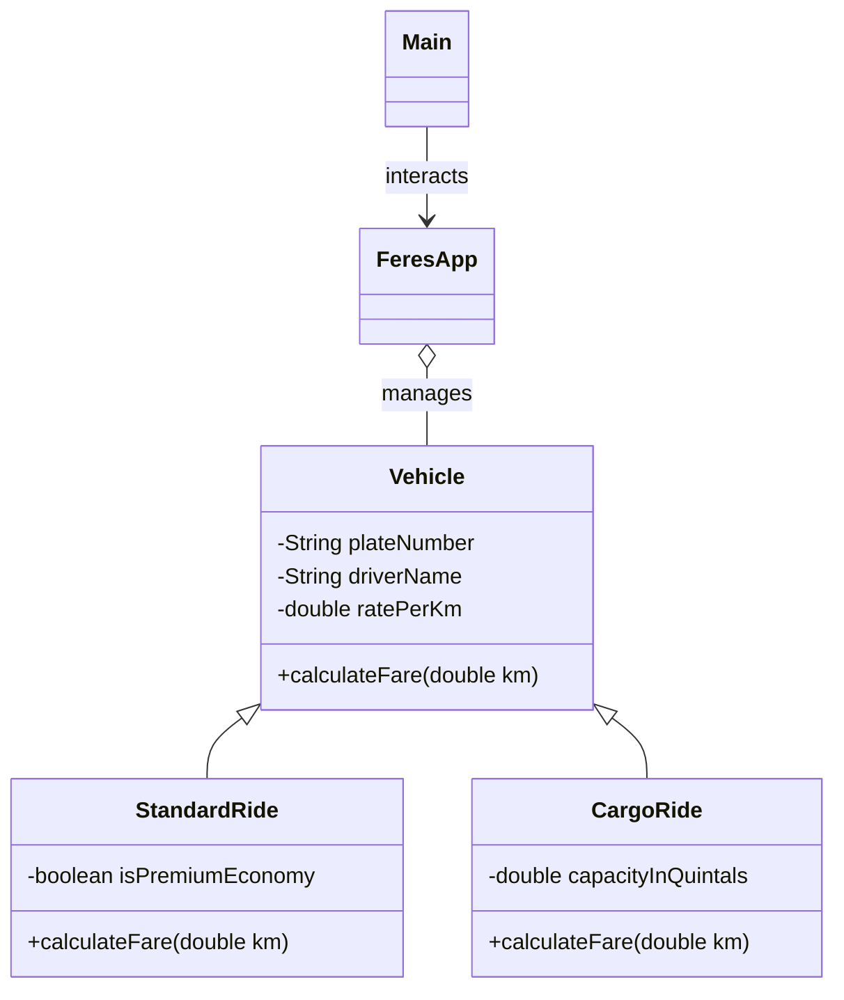

# 🚖 Feres 🇪🇹  
### Java-Based Ride Booking & Registry MVP

<p align="center">
  
  
  
  
</p>

---

# 📚 Table of Contents

- [📌 Project Description](#-project-description)
- [🏗️ System Architecture](#️-system-architecture)
- [📂 Project Structure](#-project-structure)
- [📊 Class Relationship Diagram](#-class-relationship-diagram)
- [🛠️ OOP Concept Demonstration](#️-oop-concept-demonstration)
  - [✅ 1. Classes and Objects](#-1-classes-and-objects-v10--v20)
  - [🔒 2. Encapsulation](#-2-encapsulation-v10--v20)
  - [🧬 3. Inheritance](#-3-inheritance-v30)
  - [🎭 4. Polymorphism](#-4-polymorphism-v40)
    - [🔁 Runtime Polymorphism](#-runtime-polymorphism-method-overriding)
    - [🔀 Compile-Time Polymorphism](#-compile-time-polymorphism-method-overloading)
- [🚀 Core Features](#-core-features)
- [💻 Example Terminal Flow](#-example-terminal-flow)
- [🧪 How to Run](#-how-to-run)
- [📚 Technologies Used](#-technologies-used)
- [🎯 MVP Goals Achieved](#-mvp-goals-achieved)
- [👨‍💻 Author](#-author)
- [📜 License](#-license)
- [🌍 Inspiration](#-inspiration)

---

# 📌 Project Description

**Feres** is a Java-based console application that simulates a simplified Ethiopian taxi booking and logistics booking platform.

The project was developed as a **Minimum Viable Product (MVP)** to demonstrate the core Object-Oriented Programming concepts covered in:

- V1.0 → Introduction to OOP in Java
- V2.0 → Core OOP Concepts
- V3.0 → Java Inheritance
- V4.0 → Java Polymorphism

The system allows users to:

- Register drivers dynamically
- Book passenger or cargo rides
- Calculate fares using polymorphism
- Manage vehicles using object-oriented architecture
- Handle group bookings through method overloading

---

# 🏗️ System Architecture

The application follows a clean layered structure:

| Layer | Responsibility |
|---|---|
| **Models** | Vehicle entities and subclasses |
| **Controller** | Booking and registration logic |
| **View** | Console interaction layer |

---

# 📂 Project Structure

```plaintext
feres/
├── Main.java
├── Vehicle.java
├── StandardRide.java
├── CargoRide.java
└── FeresApp.java
```

---

# 📊 Class Relationship Diagram



---

# 🛠️ OOP Concept Demonstration

---

# ✅ 1. Classes and Objects (V1.0 & V2.0)

The project models real-world transportation services using classes and objects.

### 📍 Example — `Main.java`

```java
StandardRide taxi =
    new StandardRide("AA-C23456", "Henok", 20, false);

CargoRide truck =
    new CargoRide("AA-B35321", "Biruk", 30, 150);
```

### ✔ Demonstrated Concepts

- Object creation
- Constructors
- Real-world modeling
- Class instantiation

---

# 🔒 2. Encapsulation (V1.0 & V2.0)

The system protects internal data using:

- `private` access modifiers
- Getters
- Setters
- Validation logic

### 📍 Example — `Vehicle.java`

```java
private double ratePerKm;

public double getRatePerKm() {
    return ratePerKm;
}

public void setRatePerKm(double ratePerKm) {

    if (ratePerKm > 0) {
        this.ratePerKm = ratePerKm;
    } else {
        this.ratePerKm = 25.0;
    }
}
```

### ✔ Benefits

- Prevents invalid data
- Protects internal state
- Improves maintainability

---

# 🧬 3. Inheritance (V3.0)

The project demonstrates inheritance using a parent `Vehicle` class.

### 📍 Inheritance Hierarchy

```plaintext
Vehicle
   ├── StandardRide
   └── CargoRide
```

### 📍 Example — `StandardRide.java`

```java
public class StandardRide extends Vehicle
```

### 📍 Example — `CargoRide.java`

```java
public class CargoRide extends Vehicle
```

### ✔ Benefits

- Reduces duplicate code
- Promotes code reusability
- Simplifies scalability

---

# 🎭 4. Polymorphism (V4.0)

The project demonstrates both:

- Runtime Polymorphism
- Compile-Time Polymorphism

---

# 🔁 Runtime Polymorphism (Method Overriding)

Each subclass overrides `calculateFare()` differently.

### 📍 Example — `StandardRide.java`

```java
@Override
public double calculateFare(double kilometers) {

    if (isPremiumEconomy) {
        return super.calculateFare(kilometers) + 20.0;
    }

    return super.calculateFare(kilometers);
}
```

### 📍 Example — `CargoRide.java`

```java
@Override
public double calculateFare(double kilometers) {

    double baseLoadingFee = 150.0;

    return super.calculateFare(kilometers)
            + baseLoadingFee;
}
```

### 📍 Dynamic Dispatch Example — `Main.java`

```java
double fare = v.calculateFare(km);
```

Even though `v` is referenced as `Vehicle`,
Java dynamically calls the correct subclass method at runtime.

---

# 🔀 Compile-Time Polymorphism (Method Overloading)

The booking method is overloaded to support different ride scenarios.

### 📍 Example — `FeresApp.java`

```java
public void processBooking(
        Vehicle vehicle,
        String passengerName) {

}
```

```java
public void processBooking(
        Vehicle vehicle,
        String passengerName,
        int passengerCount) {

}
```

### ✔ Purpose

- Supports standard bookings
- Supports group bookings
- Demonstrates method overloading

---

# 🚀 Core Features

✅ Driver Registration  
✅ Passenger Ride Booking  
✅ Cargo Delivery Booking  
✅ Runtime Fare Calculation  
✅ Premium Ride Pricing  
✅ Group Booking Support  
✅ Vehicle Filtering using `instanceof`  
✅ Dynamic Driver Management using `ArrayList`  
✅ Input Validation & Buffer Cleaning  
✅ Console-Based User Interface  

---

# 💻 Example Terminal Flow

```bash
==================================
   ** FERES TERMINAL **
==================================

1. Register as a Driver
2. View All Online Drivers
3. Book a Trip
4. Exit
```

---

# 🧪 How to Run

## Step 1 — Clone Repository

```bash
git clone https://github.com/your-username/feres.git
```

---

## Step 2 — Navigate Into Project

```bash
cd feres
```

---

## Step 3 — Run the Application

```bash
java Main.java
```

---

## ✅ Expected Result

After running the program, the terminal menu will appear:

```bash
==================================
   ** FERES TERMINAL **
==================================

1. Register as a Driver
2. View All Online Drivers
3. Book a Trip
4. Exit
```

---

# 📚 Technologies Used

- Java
- Object-Oriented Programming (OOP)
- Java Collections Framework
- Terminal I/O
- Runtime Polymorphism
- Method Overloading
- Inheritance
- Encapsulation

---

# 🎯 MVP Goals Achieved

| Requirement | Status |
|---|---|
| Classes & Objects | ✅ |
| Encapsulation | ✅ |
| Inheritance | ✅ |
| Runtime Polymorphism | ✅ |
| Compile-Time Polymorphism | ✅ |
| Functional MVP | ✅ |

---

# 👨‍💻 Author

## Dagim Yosef ( REDRAGON_🇪🇹 )

First-year Software Engineering student and passionate Java enthusiast focused on learning object-oriented programming, backend development, and clean software design principles.

---

# 📜 License

This project is licensed under the MIT License.

---

# 🌍 Inspiration

> “Built with Java. Inspired by Ethiopian mobility innovation.” 🇪🇹
